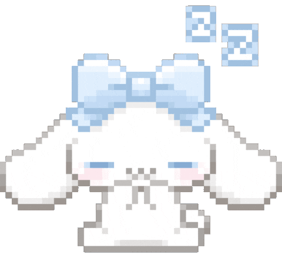

<div align="center">
  
  <br/><br/>

  [](https://git.io/typing-svg)

  <br/><br/>

  <a href="https://www.instagram.com/nt_1xs/">
    
  </a>
  &nbsp;
  <a href="https://discord.com/users/XeSuzu">
    
  </a>

  <br/><br/>

  
  
  
  
  
</div>

---

## 👾 Sobre mí

Soy **Hannae**, developer de 🇪🇨 Ecuador.  
Trabajo con TypeScript, bots de Discord, APIs, rutas e interfaces que se sientan bien al usarlas.

Me interesa el punto donde se cruzan diseño, lógica y experiencia.  
No me quedo solo en cómo se ve algo, también me importa cómo funciona por dentro y qué tan bien se sostiene con el tiempo.

```ts
const hannae = {
  name: "Hannae",
  location: "Ecuador 🇪🇨",
  mainLanguage: "TypeScript",
  focus: [
    "Discord bots",
    "APIs",
    "Routes",
    "UI that feels good to use"
  ],
  currentlyBuilding: ["Hoshiko"],
  stack: {
    frontend: ["React", "Next.js", "TailwindCSS", "HTML", "CSS"],
    backend: ["Node.js", "Express", "REST APIs", "Discord.js"],
    databases: ["MongoDB", "MySQL", "Firebase"],
    tools: ["Git", "Linux", "Bash", "Figma"]
  },
  strengths: [
    "Modular architecture",
    "Real-time systems",
    "Persistent flows",
    "Developer experience"
  ],
  philosophy: "Que se vea bien. Que funcione mejor."
};
```

---

## ✦ Highlights

<div align="center">

| Área | Enfoque |
|------|---------|
| 🤖 Bots | Bots de Discord con personalidad, sistemas y features útiles |
| 🔌 APIs | Rutas, integraciones y lógica para flujos reales |
| 🧠 Arquitectura | Estructura modular, orden interno y escalabilidad |
| 🎨 UI/UX | Interfaces claras, cuidadas y agradables de usar |

</div>

---

## 🌸 Proyecto principal

<div align="center">


</div>

**Hoshiko** es el proyecto donde más se nota cómo pienso y construyo.  
Es un bot de Discord con personalidad propia, enfocado en interacción, automatización, sistemas sociales y funciones con IA.

<details open>
<summary><strong>Lo que tiene</strong></summary>

<br/>

- Moderación basada en puntos.
- Sistema de memes con ranking en tiempo real.
- Interacciones sociales dentro de servidores.
- Conversación con IA.
- Historial persistente por usuario y contexto.
- Acciones automáticas configurables por servidor.

</details>

<details open>
<summary><strong>Por debajo</strong></summary>

<br/>

- Arquitectura modular.
- Sistema de seguridad propio.
- Blacklist, rate limiter y sanitizado.
- Integración con MongoDB.
- Manejo de estado y persistencia.
- Separación clara entre lógica, handlers y features.

</details>

<br/>

<div align="center">


</div>

---

## 🛠️ Stack técnico

<div align="center">


</div>

<div align="center">

```txt
Frontend   → React, Next.js, Tailwind, HTML, CSS
Backend    → Node.js, Express, APIs, rutas, integraciones
Database   → MongoDB, MySQL, Firebase
Tools      → Figma, Git, Linux, Bash
```

</div>

---

## 🏆 Logros visuales

<div align="center">

[](https://github.com/ryo-ma/github-profile-trophy)

</div>

---

## 📊 GitHub stats

<div align="center">


&nbsp;


<br/><br/>


</div>

---

## 🌐 Conecta conmigo

<div align="center">

<a href="https://www.instagram.com/nt_1xs/">
  
</a>
&nbsp;&nbsp;
<a href="https://discord.com/users/XeSuzu">
  
</a>

<br/><br/>


</div>
